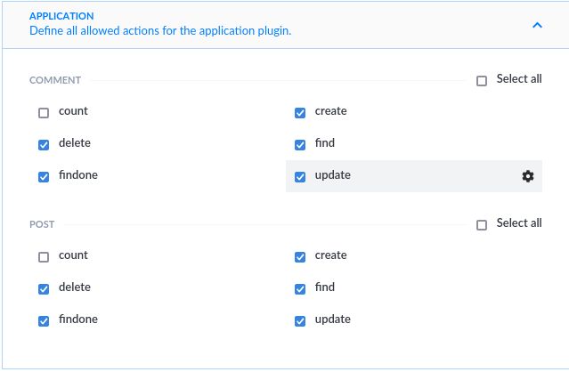
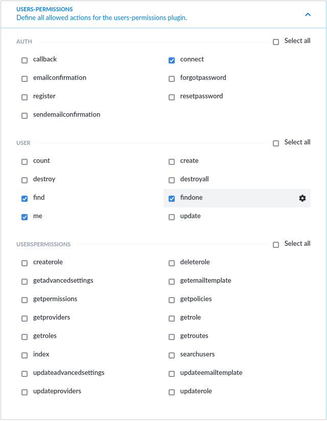

#### KagariNetwork

Feel free to send a PR to change/add or correct my project.

## Install

`./ yarn install`

`./backend/ yarn install`

`./frontend/ yarn install`

## Backend Settings

For Strapi and the frontend to work smoothly it is necessary to make some adjustments to the roles.

The frontend uses the user's token to create new posts or reply, so it is necessary to enable the necessary permissions for authenticated users.
Link to the role settings page:
http://localhost:1337/admin/settings/users-permissions/roles/1

And these are the settings

Then click the save button and confirm the changes... then create a user and that's it, you can login from the frontend...

Note: banner and avatar are required...
## START

`./backend/ yarn develop`

`./frontend/ yarn start`

or 

`./ yarn start`